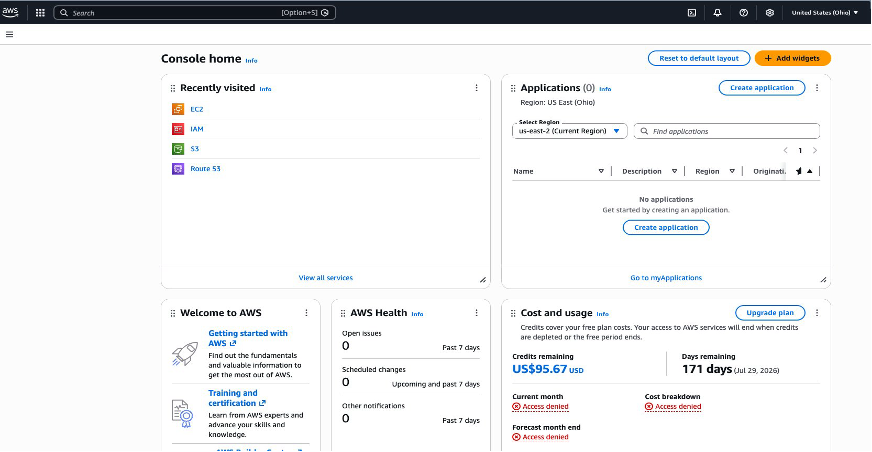

# AWS Lift and Shift: Multi-Tier Web Application Deployment

## Project Overview
This project documents a lift-and-shift migration of the VProfile multi-tier web application to AWS. The application stack is moved to EC2 with minimal code changes while adding managed AWS services for availability, security, and scalability.

VProfile is a Java-based social networking platform with four core services:
- Tomcat 10 application server (WAR deployment)
- MySQL database (persistent data)
- Memcached (database query cache)
- RabbitMQ (asynchronous messaging)

Each service runs on its own EC2 t3.micro instance. AWS managed services are layered on top: Application Load Balancer, Auto Scaling Group, S3 artifact storage, Route 53 private DNS, and ACM for TLS. The public entry point is https://vprofileapp.theenuka.xyz.

## Architecture and Technology Stack
The architecture follows a three-tier design:
- Presentation tier: Application Load Balancer (public HTTPS)
- Application tier: Tomcat EC2 instance (project-app01)
- Data tier: MySQL (project-db01), Memcached (project-mc01), RabbitMQ (project-rmq01)

All internal service communication uses Route 53 private DNS (vprofile.in) to avoid hard-coded IPs.

| Component | Details |
| --- | --- |
| Application server | Apache Tomcat 10 on EC2 t3.micro - project-app01, us-east-2c |
| Database | MySQL on EC2 t3.micro - project-db01, port 3306, us-east-2c |
| Cache | Memcached on EC2 t3.micro - project-mc01, port 11211, us-east-2c |
| Message broker | RabbitMQ on EC2 t3.micro - project-rmq01, port 5672, us-east-2c |
| Load balancer | Application Load Balancer - vprofile-theenuka-elb (internet-facing, IPv4), 3 AZs |
| Target group | vprofile-theenuka-tg - HTTP, port 8080 |
| Auto Scaling Group | vprofile-theenuka-app-asg - min 1, desired 1, max 4, 3 AZs |
| Artifact store | S3 bucket - vprofile-theenu-artifacts - vprofile-v2.war |
| Private DNS | Route 53 private hosted zone - vprofile.in - 4 A records |
| SSL certificate | ACM wildcard certificate - *.theenuka.xyz |
| Public domain | GoDaddy - theenuka.xyz - CNAME vprofileapp -> ELB DNS |
| SSH key pair | project-prod-key (RSA) |
| VPC | vpc-default |
| AWS region | US East (Ohio) - us-east-2 |

## Flow of Execution (12 Steps)
Each step below includes the related screenshot from docs/images.

### Step 1: Log in to AWS and set the region
Confirmed the console region as US East (Ohio), us-east-2.

### Step 2: Create a key pair
Created project-prod-key (RSA) for SSH access across all EC2 instances.

### Step 3: Create security groups
Defined layered security groups for ELB, app tier, and backend tier with strict ingress rules.

### Step 4: Launch EC2 instances with user data
Provisioned four t3.micro instances with user data scripts for automated setup.

### Step 5: Configure Route 53 private DNS
Created private hosted zone vprofile.in with A records for app, db, cache, and broker.

### Step 6: Build the application from source
Ran mvn install to compile and package the application as vprofile-v2.war.

### Step 7: Upload the artifact to S3
Uploaded vprofile-v2.war to s3://vprofile-theenu-artifacts.

### Step 8: Deploy the artifact to Tomcat
Replaced ROOT app on project-app01 and restarted Tomcat 10.

### Step 9: Configure ALB with HTTPS
Issued ACM wildcard certificate, created ALB and target group, and set HTTP/HTTPS listeners.

### Step 10: Point domain to the load balancer
Added GoDaddy CNAME vprofileapp -> ELB endpoint and validated DNS records.

### Step 11: Verify the full deployment
Verified HTTPS, certificate, login, RabbitMQ status, MySQL user list, and Memcached caching.

### Step 12: Build an Auto Scaling Group
Created AMI, launch template, and ASG for the application tier.

## Technical Skills Demonstrated
- AWS infrastructure provisioning across EC2, S3, Route 53, ALB, ACM, and ASG
- Linux server automation with user data and service management with systemctl
- Layered security group design for tiered access control
- Java build pipeline with Maven and WAR artifact management
- DNS architecture for private service discovery and public domain routing
- HTTPS and certificate management with ACM
- End-to-end validation of app, cache, database, and message broker integrations

## Conclusion
This project delivers a complete lift-and-shift migration of a Java multi-tier application to AWS. The application is securely exposed over HTTPS through an ALB across three availability zones, backed by EC2 instances for Tomcat, MySQL, Memcached, and RabbitMQ. Private DNS via Route 53 simplifies internal communication, and the app tier is prepared for scale-out using a custom AMI, launch template, and Auto Scaling Group. The deployment was fully verified, including cache behavior, database reads, and RabbitMQ connectivity.
